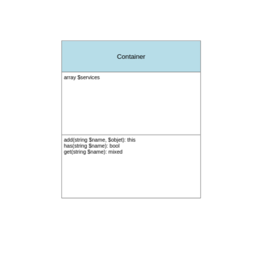

# Le Container

Afin de réspécter le **I** du **SOLID** (Inversion de contrôle : Un objet pour tous les controller !),
nous devons mettre en place une « Container »

Cette classe vas contenir **toutes les instances** de **toutes les classes** de notre
projet.

C'est un peu comme une armoire :

- Chaque tiroir possède un nom
- Nous pouvons récupérer le contenu du tiroir (l'instance de l'objet).

## Le diagram de class :



## Créer la classe « Container »

Cette classe doit être rangé dans `src/Core`.

Elle contient une propriété "protected" : `protected array $services`. Cette propriétés contiendra
toutes les instances. C'est un tableaux associatif ou chaque clés est associé à une instance.

Voici un exemple d'utilisation de classe « Container » :

```php
<?php

use App\Core\Container;
use App\Core\Configuration;
use App\Core\View;

$container = new Container();

// Enregistré des services :
$container->add('config', new Configuration(__DIR__ . '/..'));
$container->add('view', new View(__DIR__ . '/../templates'));

// On peut tester si un service éxsiste :
$container->has('config'); // true
$container->has('nimportequoi'); // false

// On peut récupérer un service :
// Éxemple : récupération du nom de la base de données en utilisant
$container->get('config')->get('DATABASE_NAME');

$container->get('nimportequoi'); // ERREUR !!!

// Exemple : Afficher le template (page) hello.php
echo $container->get('view')->render('hello', ['name' => 'John Doe']);
```

Afin de créer cette class :

- 1. Créer une class « Container » dans le dossier `src/Core`
- 2. Créer un constructeur sans paramètres qui initalize à la propriétés "$services" avec un tableaux vide
     (`$this->services = [];`)
- 3. Créer la méthode `add`. Cette méthode reçoit 2 paramètres
  - 1. `string $name` : C'est le nom du service
  - 2. `$object` : C'est le service
       Avec ces deux paramètre, ajouter le service dans le tableaux `$this->services`.
- 4. Créer la méthode `has`.
- 5. Créer la méthode `get`.

> **ATTENTION**
> Le container doit retourner une erreur si nous essayons d'enregistrer 2 fois le même service
> Le container doit retourner une erreur si nous essayons d'obtenir un service qui n'est pas enregistré

## Utiliser le container

Dans le fichier `public/index.php`, remplacer et enregistré tout les "new" dans le container.
