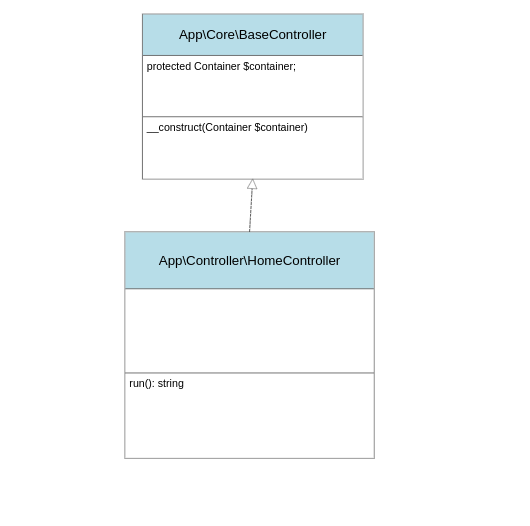

# Le Controller

Le controller représente le « cerveau » d'une page. Chaque controller
à pour rôle d'afficher le contenu d'une page.

Afin de fonctionner, il doit posséder le « Container ».

## Diagramme de classe

## Créer la classe « BaseController »

En suivant le diagramme de classe, créer la classe
« BaseController » (dans `src/Core`).

> **BONUS**
> Cette classe ne peut pas être instancié (on ne peut pas faire new dessus) ...

## Créer la classe « HomeController »

En suivant le diagramme de classe, créer la classe « HomeController » (dans `src/Controller`).

Cette classe possède 1 seule méthode : `run(): string` et dont le rôle est d'afficher
la page (template) d'accueil de notre blog.

Pour la page d'accueil afficher le titre des 10 derniers articles.

## Enregistrer le « HomeController » dans le « Container »

Dans la méthode `boot` de notre « Container », ajouter le « HomeController ».

## Utiliser le « HomeController »

Dans le fichier `public/index.php`, récupérer le « HomeController » et afficher
le contenue de la méthode `run`.
