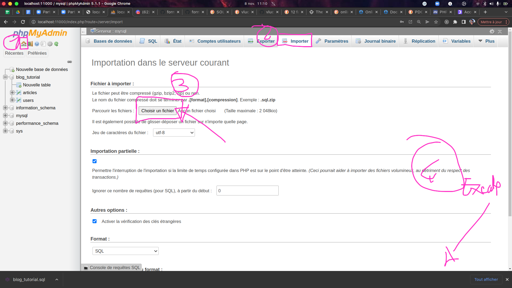
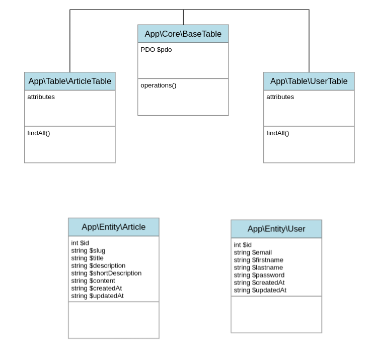

# Le Model

Le model est un concept générale qui englobe tout ce qui concerne la gestion
des données (une base de données, LDAP, les api's, etc ...).

Nous pouvons implémenter le model en suivant différentes architecture :

- L'active record : C'est la possibilité de créer des classes model contenant
  à la fois les données et le traitement.
- Le Data Mapper : C'est l'architecture la plus proche d'une base de données.
  Elle sépare les données sous forme d'entité, et le traitement sous forme
  table.

Nous utiliserons le DataMapper.

## Révision sur PDO

En PHP il éxsiste une classe permettant de gérer notre base de données,
cette class c'est PDO.

Vous retrouverez un petit tutoriel sur PDO juste [ici](https://openclassrooms.com/fr/courses/918836-concevez-votre-site-web-avec-php-et-mysql/914293-accedez-aux-donnees-en-php-avec-pdo)

Voici les commandes de base de PDO :

```php

// La connection à la base :
$pdo = new PDO(
	'mysql:host=localhost;port=3306;dbname=blog_tutorial',
  'root',
  'root',
);

// Préparation d'une requête
$request = $pdo->prepare('SELECT * FROM user WHERE id = :id');

// On ajoute un paramètre (PDO::PARAM_INT, PDO::PARAM_BOOL, PDO::PARAM_STR):
$request->bindParam('id', 3, PDO::PARAM_INT);

// Lancement de la requête
$request->execute();

// Récupération d'un seul résultat (array) :
$data = $request->fetch();

// Récupération d'un seul résultat et stockage du résultat :
$user = $request->fetch(PDO::FETCH_CLASS, 'App\\Entity\\User');

// Récupération de plusieurs résultats :
$data = $request->fetchAll();

// Récupration de plusieurs résultats sotické dans un objet :
$users = $request->fetchAll(PDO::FETCH_CLASS, 'App\\Entity\\User');

// Il est possible d'obtenir le nom d'une class (son namespace et son nom)
// en utilisant : Class::class
use App\Entity\User;

$users = $request->fetchAll(PDO::FETCH_CLASS, User::class);
```

## Téléchargez et installer la base de données

Vous pouvez [téléchargez la base données](./../blog_tutorial.sql). Une fois la base de données
téléchargé, il vous faut l'importer dans PhpMyAdmin.



## Le diagramme de classe

Afin d'implémenter notre model nous allons devoir créer les classes suivante :



## Les « entités »

Une entité c'est la représentation sous forme de classe d'une entrée de votre base de données.

Votre objéctif est de créer dans une dossier `Entity` situé dans le répertoire `src` les entités
suivante :

- User
- Article

> **IMPORTANT**
> Les entités sont considéré comme des DTO (Data Transfert Objet). Les DTO se sont des classes
> possèdant des propriétés (variables) mais **AUCUNE MÉTHODES** (function). Dans ce cas très précis
> nous pouvons ne pas faire d'encapsulation ! Nous pouvons créer des propriétés public !

## Les « tables »

Le rôle des tables c'est d'envoyer et / ou récupérer des données de notre table.

### 1. Créer la « BaseTable »

Chaque table de notre base de données doit possèder une propriété $pdo. Cette dernière
nous permettra de faires des requêtes à la base de données.

Votre rôle :

- Créer une classe « BaseTable » dans le dossier `src/Core`
- Faire en sorte que cette classe se construise avec un objet pdo et stock
  cet objet dans une propriété protected

Exemple d'utilisation :

```php
use App\Core\BaseTable;

$pdo = new PDO(
	'mysql:host=localhost;port=3306;dbname=blog_tutorial',
  'root',
  'root',
);
$table = new BaseTable($pdo);
```

## 2. Créer la table « UserTable »

- Créer une classe « UserTable » dans le dossier `src/Table`
- Cette classe hérite de la classe `BaseTable`
- Ajouter une méthode `findAll` qui retourne tout les utilisateurs de la base données
  (**ATTENTION** cette méthode doit retourner un tableaux d'objet 'App\Entity\User').

Exemple d'utilisation :

```php
use App\Table\UserTable;

$pdo = new PDO(
	'mysql:host=localhost;port=3306;dbname=blog_tutorial',
  'root',
  'root',
);
$table = new UserTable($pdo);

// Récupération de tout les users de la database
$users = $table->findAll();

foreach ($users as $user) {
  // ici $user est une instance de App\Entity\User
  echo $user->id;
  echo $user->email;
}
```

## 3. Créer la table « ArticleTable »

- Créer une classe « ArticleTable » dans le dossier `src/Table`
- Cette classe hérite de la classe `BaseTable`
- Ajouter une méthode `findAll` qui retourne tout les utilisateurs de la base données
  (**ATTENTION** cette méthode doit retourner un tableaux d'objet 'App\Entity\Article').

Exemple d'utilisation :

```php
use App\Table\ArticleTable;

$pdo = new PDO(
	'mysql:host=localhost;port=3306;dbname=blog_tutorial',
  'root',
  'root',
);
$table = new ArticleTable($pdo);

// Récupération de tout les users de la database
$articles = $table->findAll();

foreach ($articles as $article) {
  // ici $user est une instance de App\Entity\Article
  echo $article->id;
  echo $article->description;
}
```
