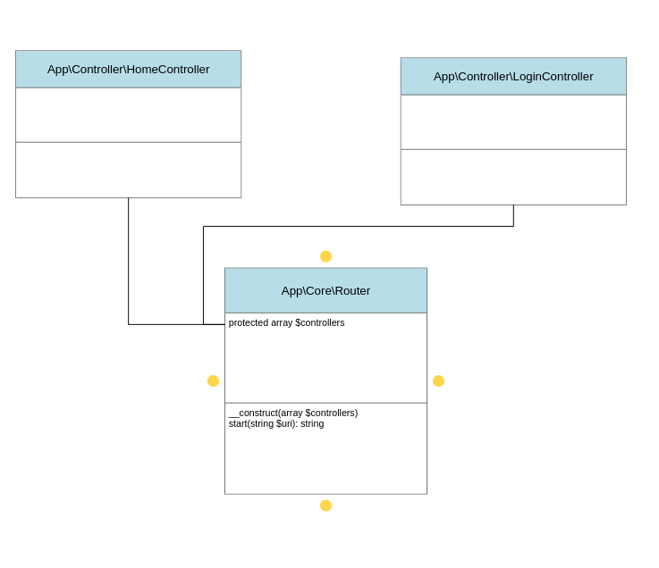

# Le Router

Le router c'est un objet qui s'occupe d'un job :

- Trouver le bon controller pour la bonne URI (`$_SERVER['REQUEST_URI']`) !

## Le diagram de class

## Créer la class « Router »

Dans `src/Core`, ajouter une classe `Router` qui

- Se contruit avec un tableaux de tout les controllers
- Qui possède une méthode `start` qui `run` le bon controller en fonction d'une URI (`$_SERVER['REQUEST_URI']`)
