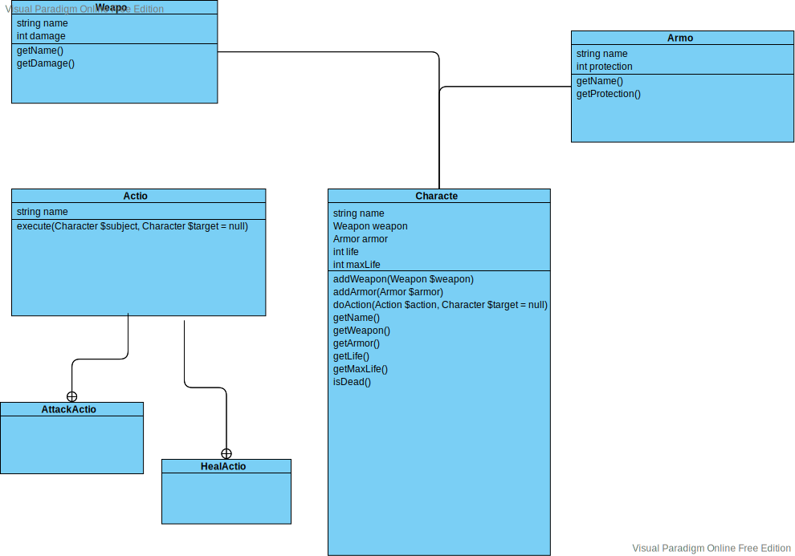

# Exercice 3 : Le Jeux

Le but de cette exercice est de réaliser l'implémentation du diagram de classe :



## 1. Créer la class « Weapon »

En utilisant votre éditeur de code et le répertoire « src », créé une
class Weapon qui contient les propriétés et le méthodes du diagramme
de classe plus haut.

> Afin de tester votre code, vous pouvez créer un nouveau script
> dans le répertoire « bin » (ex: test-weapon.php) et placer
> le code suivant ) l'intérieur :
>
> ```php
> require __DIR__ . '/../vendor/autoload.php';
>
> use App\Weapon;
>
> $sword = new Weapon('sword', 25);
> echo $sword;
> ```
>
> Pour éxécuter ce script dans votre terminal :
>
> ```
> php bin/test-weapon.php
> ```

## 1. Créer la class « Armor »

En utilisant votre éditeur de code et le répertoire « src », créé une
class Armor qui contient les propriétés et le méthodes du diagramme
de classe plus haut.

> Afin de tester votre code, vous pouvez créer un nouveau script
> dans le répertoire « bin » (ex: test-armor.php) et placer
> le code suivant ) l'intérieur :
>
> ```php
> require __DIR__ . '/../vendor/autoload.php';
>
> use App\Armor;
>
> $armor = new Armor('Veste en cuir', 25);
> echo $armor;
> ```
>
> Pour éxécuter ce script dans votre terminal :
>
> ```
> php bin/test-armor.php
> ```
