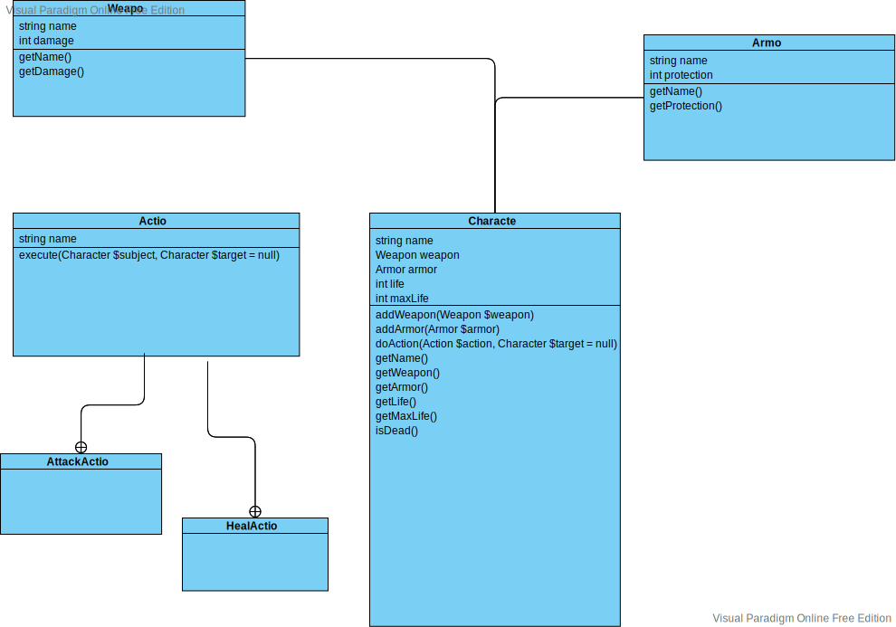

# Exercice 4 : Créer le personnage

Le but de cette exercice est de réaliser l'implémentation du diagram de classe :



## 1. Créer la class « Character »

En utilisant votre éditeur de code et le répertoire « src », créé une class Character qui contient les propriétés et le méthodes du diagramme de classe plus haut.\*

#### Ne pas mettre la méthode « doAction » tout de suite, ce sera pour l'exercice suivant :)

> Afin de tester votre code, vous pouvez créer un nouveau script
> dans le répertoire « bin » (ex: test-character.php) et placer
> le code suivant ) l'intérieur :
>
> ```php
> require __DIR__ . '/../vendor/autoload.php';
>
> use App\Character;
>
> $jeanLuc = new Character(
>       'Jean Luc - le chevalier',
>       150,
>       new Weapon('Grosse Épèe', 30),
>       new Armor('Cuirasse', 60),
> );
> echo $jeanLuc;
> ```
>
> Pour éxécuter ce script dans votre terminal :
>
> ```
> php bin/test-character.php
> ```
